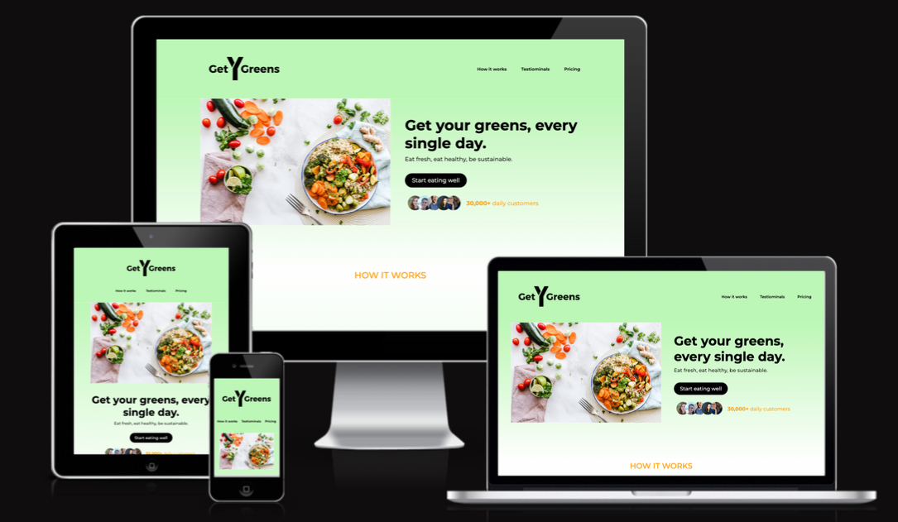

# GetYourGreens

## [Click here](https://codewithmaik.github.io/get-your-greens/) to visit the website live.

GetYourGreens is a online grocery store that specializes in delivering fruits and vegetables to customers. They maintain collaborations with local farmers to ensure that customers receive the freshest products possible. Customers can choose from a wide range of products in the online store and are able to customize their food box.

This project is a the first portfolio project of the Fullstack Software Development Program of [Code Institute](https://codeinstitute.net). The goal is to build a static website using HTML and CSS, two of the three core technologies of the web. Please note that GetYourGreens is a fictial company and you are not able to register for their service on the website.

## User Experience Design

As part of the project planning, I use the 5 planes of user experience design, taught in Code Institute's Fullstack Software Development Program. In this section, I sum up the business and user goals to get a better understanding of which features the website should contain. In addition, I create a mockup to visualize my ideas for the first version of the website.

### Business Goals

The business goals of GetYourGreens are to provide a convenient and time saving online grocery delivery service. The main goal is to offer high-quality and locally sourced products and create a positive user experience by offering customizable food boxes. The goals when creating a website for GetYourGreens is to build a strong online presence that attracts customers. In order to achieve that, the user should be able to understand the business easily and should be able to sign up for the service quickly. The website should include customer feedback to build trust with potential customers. Moreover, the website should be responsive to allow customers to access the website from any device.

### User Goals

The user goals are to have access to high-quality, fresh and locally sourced products while saving time and effort by using a delivery service. They want their orders to be customizable to their specific needs. User goals when visiting the website of GetYourGreens are to easily understand the business and find the most relevant information quickly (e.g. process, pricing). In addtion, user want to sign up for the service without taking a lot of risk.

### Mockup

The following Mockup was created on [Balsamiq Cloud](https://balsamiq.cloud/).

## Features

In this section, I show and describe the features the website has and compare them to the initial Mockup I created.

### Header

The header contains a company logo to encourage brand awareness. Next to it there is a navigation bar, which allows the user to easily jump between the page sections. The only difference from the mockup is that there is no recipes section. This could be included in a future implementation to support the user to cook healthy meals. Moreover, the call to action button is not included in the header. To find out where to call to action button should be located optimally, the conversion rate needs to be tested.

### Hero Section

The hero section features a large image to show the potential customers how GetYourGreen's products look like. It also includes a title and a brief description that communicates the value GetYourGreens customers receive. Multiple customer images are displayed to build trust. The highlight is the call-to-action button, which allows the user to quickly jump to the registration process.

### How It Works Section

The How it works section was implemented as planned. It shows to the user how simple the process is and support the understanding of the process through small images.

### Testimonials Section

The Testimonial section was implemented slightly differently than planned. I decided to leave out the a gallery of images and instead focused on 3 testimonials to avoid overloading the section and to keep it clear.

### Pricing Section

The Pricing section was implemented as planned, except that there are now two instead of three pricing models. The user can quickly see what each pricing model includes and has the option to jump to the registration process using the call-to-action button.

### Signup Section

In comparison to the mockup, the implementation of the signup section is mirrored. On the left side, there is an image of a man delivering a greens box, while on the right side, the user receives the offer to get the first delivery for free if they sign up now. They need to enter their first name, last name, and email address before registering with the call-to-action button.

### Footer

The implementation of the footer is as planned, except that the social media links and contact information are displayed vertically instead of horizontally. When the user clicks on the social media icons, a new tab opens.

## Testing

### Code Validation

- I confirm that no errors occured running the HTML code through the [Markup Validation Service](https://validator.w3.org/).

- I confirm that no errors occured running the CSS code through the [CSS Validation Service](https://jigsaw.w3.org/css-validator/)

### Browser Compatibility

I confirm that the website works and looks good on the three main browsers: Google Chrome, Safari, Mozilla Firefox. Something has been noticed in the Safari browser that is mentioned in the Unsolved Bugs section.

### Responsiveness

I can confirm that the website works and looks good on all standard screen sizes using the chrome developer tools. In additon, the websites responsiveness was tested on an IPhone 12 Pro and a MacBook Air.

### Lighthouse

I tested the website's performance, accessibility, best practices and SEO using lighthouse by chrome developer tools.

The scores were perfect, except the SEO score. In order to improve it, lighthouse advises to add a meta description tag. After doing this, the website reaches the maximum scores in all categories.

### Features

- I confirm that the navigation bar works. The user jumps to the section after clicking them.

- I confirm that the call to action button in the hero section works. The user jumps to the signup section after clicking it.

- I confirm that the call to action buttons in the pricing section work. The user jumps to the signups section after clicking them.

- I confirm that the form works. First name, last name, as well as the email address is required to submit the form. When clicking the submit button, the user jumps right back on the top of the page, because there is no backend application the website is linked to.

- I confirm that the social media icons work. After clicking them, a new tab opens in the browser.

## Bugs

### Solved Bugs

- After changing the grid layout in the media query in the how it works section, the grid elements were displayed in a wrong order. I found the solution for this problem in this [article](https://www.sitepoint.com/order-align-items-grid-layout/)

### Unsolved Bugs

